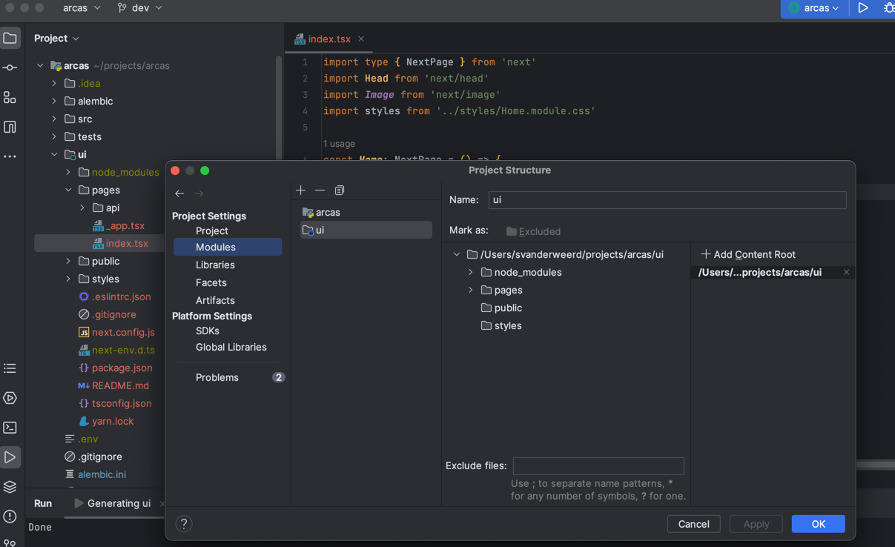

Although [IntelliJ IDEA](https://www.jetbrains.com/idea/old/) is tailored for Java and JVM, it is a multi-language IDE
that supports Rust, Javascript, Python, SQL, and numerous other languages.

# Projects and modules

If you want to combine multiple codebases into 1 intellij project (for example, if you have a frontend in `React`
and a backend in `Python` or `Rust`), you can use `import module`.

Let's say that you have a `Python` project where you develop your backend. Now, you want to add a `React` frontend
to it (effective creating a monorepo structure). You can do this by importing the frontend as a `module` to
your `Python` project:

1. Import / Open the project as a `Python project`.
2. Then in the `Project Structure` settings, click on the `modules` menu and then add/import a`React` module. This
   allows you to add, e.g., a React "facet" to the module. This can be used to developed mixed language modules.

The picture below shows a `ui` module, which is the `React` frontend code. It's part of the `Python` project:

# key bindings

Unicode strings for apple symbols:

| Sym | Key     |
|:---:|:--------|
|  ⌃  | Control |
|  ⌥  | Option  |
|  ⇧  | Shift   |
|  ⌘  | Command |

## Navigation

| Action    | Description                                                                            |
|-----------|----------------------------------------------------------------------------------------|
| ⌃ + [     | Move caret backwards a paragraph                                                       |
| ⌃ + ]     | Move caret forwards a paragraph                                                        |
| ⌘ + l     | Jump to `line:column`                                                                  |
| ⌘ + e     | Go to _recent files_                                                                   |
| ⌘ + ⇧ + a | Opens up _actions_                                                                     |
| ⌥ + enter | Opens up _suggestions pane_ (yellow lightbulb) options for the code where you caret is |
| ⌘ + 1     | Go to `Project` sidebar                                                                |
| ⌥ + f12   | Go to terminal                                                                         |
